# InfectoMed System

InfectoMed System is a program designed for infectious disease doctors. It allows doctors to manage patient records, medical histories, consultations, prescriptions, and provides assistance with treatment schemes and drug information.

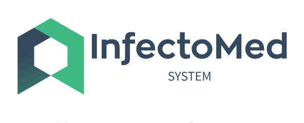

## Author
-Mariano Nicolas Aquino

## Key Features

### 1. User Authentication
Allows doctors to log in or register by entering their ID number, name, surname, password, and registration number. The registration of a new doctor is saved in the database.

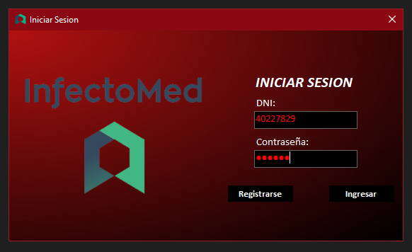
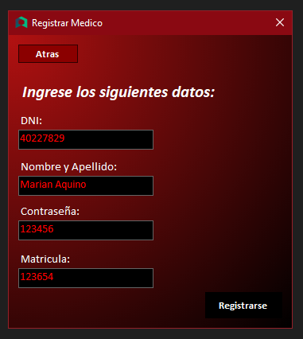

### 2. Patient Management
After logging in, doctors can view all their patients in a list, and filter them by ID number. Doctors can then access the medical history of the selected patient.

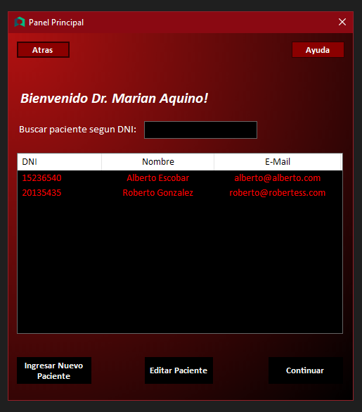

### 3. New Patient Registration
Allows registration of a new patient by entering ID number, name, surname, date of birth, profession, address, health insurance, plan, membership number, and email. The new patient is saved in the database.

### 4. Patient Data Editing
Allows editing of the selected patient's data, updating the corresponding records in the database.

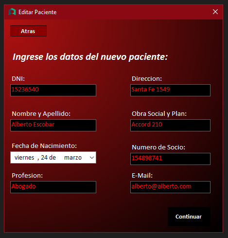

### 5. Medical History
After selecting a patient, doctors can access the patient's medical history, where they can view previous consultations with their reason and date.

### 6. Consultation Viewing
Clicking on "View Consultation" generates a PDF that allows the user to view the complete consultation with all its information.

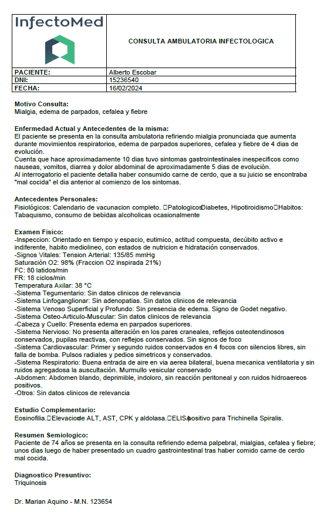

### 7. New Consultation / Edit Consultation
Clicking on "New Consultation" or "Edit Consultation" allows entering a new consultation for the patient in the database. It can include:
  - Reason for consultation
  - Current illness / illness history
  - Personal history
  - Physical examination
  - Complementary examinations
  - Semiological summary
  - Presumptive diagnosis
  - Differential diagnoses

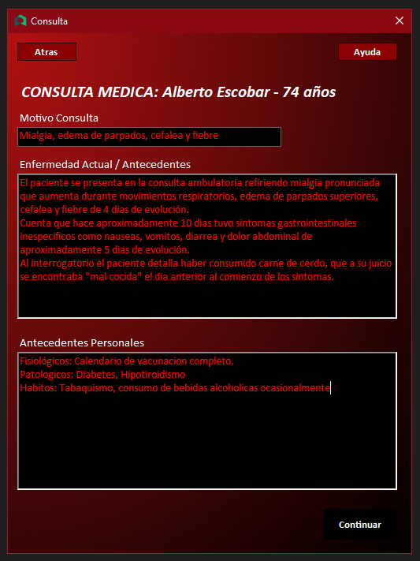
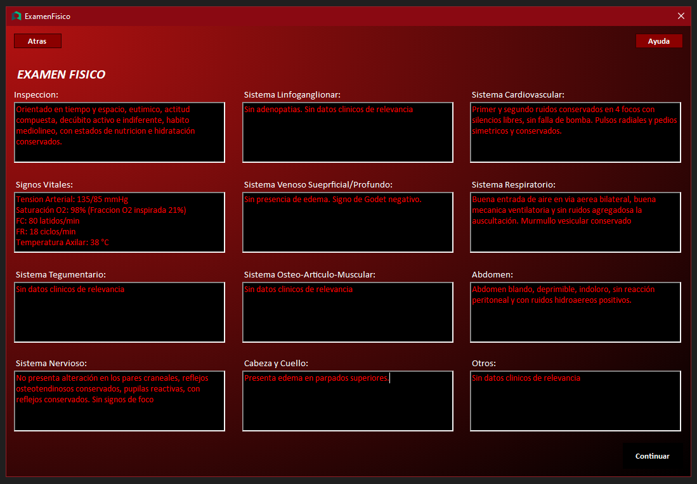
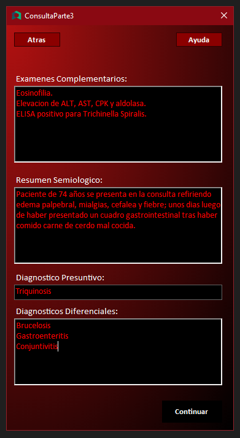

### 8. Digital Prescription/Order
Allows the doctor to complete the consultation by filling out a digital prescription or order, which the doctor can choose to print or not. This prescription or order is generated in PDF format with the system's logo, the necessary information of the patient, and the user doctor. Then, this prescription or order is saved in the database along with the rest of the consultation.

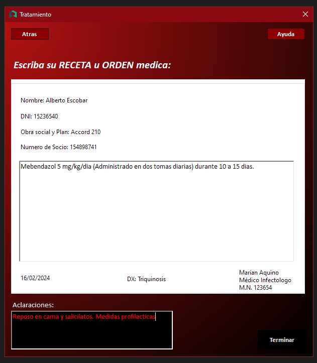
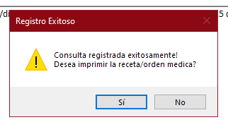
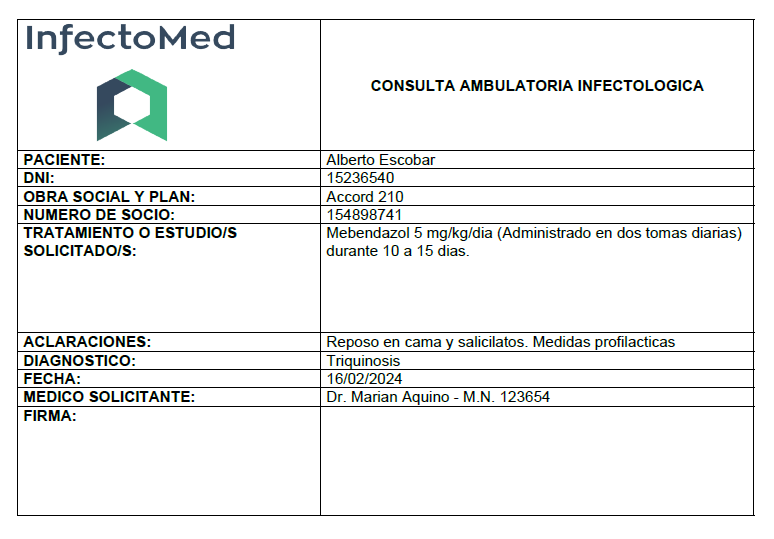

### 9. Help Functionality
A novel "Help" functionality allows the doctor to select a disease, and the program reveals the appropriate treatment scheme for it, along with the drugs that can be used. It allows selecting a drug, and then the program details the adverse effects, contraindications, and posology of the drug.

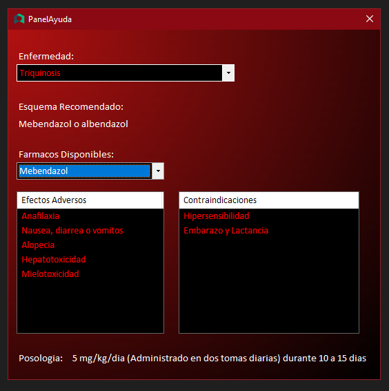

## Database

The project utilizes Microsoft SQL Server to manage the database. Below is a description of the database design and its relation to the project.

### Database Design

The project's database is designed to store critical information for the system. Several tables have been created to manage mds, patients, consultations, and other relevant aspects. Here is an overview of the Database diagram:

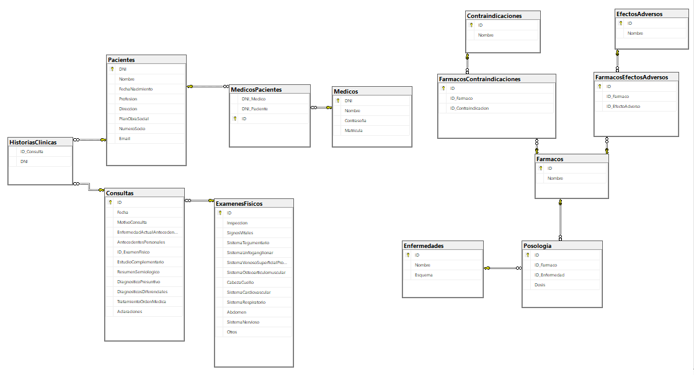

#### Installing the Database

To install this database on your SSMS just execute the SQL script located in this repository. It will create both tables and data.

## License

This project is licensed under the MIT License - see the [LICENSE](LICENSE) file for more details.